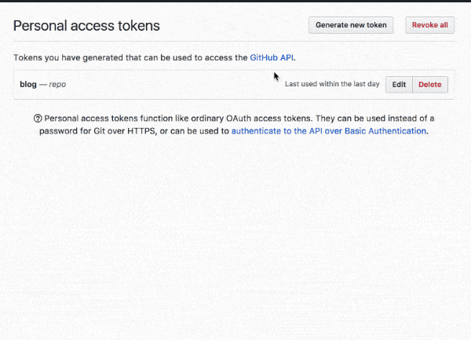
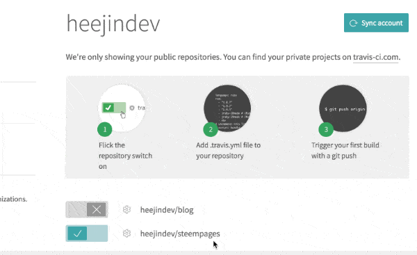
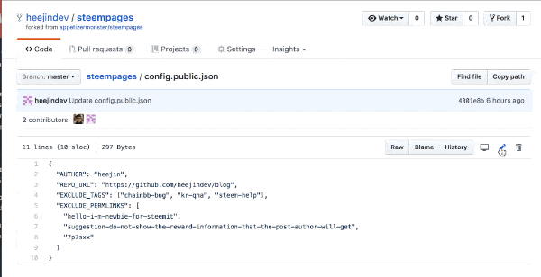

# Steempages
**Steempages**는 Travis CI를 이용해서 Github Pages 블로그에 당신의 Steemit 컨텐츠를 올릴 수 있게 도와줍니다.

Steempages를 이용하면 아래와 같은 장점이 있습니다:
- Steemit 컨텐츠를 이용해서 당신만의 블로그 사이트를 만들 수 있습니다.
- 따로 서버 호스팅을 이용할 필요가 없습니다, **무료입니다!**
- 블로그에 Disqus, Google Analytics 등의 Github Pages에서 사용할 수 있는 기능을 그대로 이용할 수 있습니다.

[데모 블로그](https://appetizermonster.github.io./blog)를 확인해보세요!

## 어떻게 동작하나요?
Travis CI의 빌드 기능을 이용해서 당신의 Steemit 컨텐츠를 Github Pages 저장소에 동기화합니다.  
당신이 직접 동기화를 시작할 수도 있고, Travis CI에서 지원하는 Cron 기능을 이용해서 자동으로 동기화할 수도 있습니다.

## 시작하기

### 1단계. 블로그용 Github Pages 저장소 준비하기

먼저, 블로그용 Github Pages 저장소가 필요합니다.
[Jekyll Now 가이드](https://github.com/barryclark/jekyll-now)를 보시면, 쉽게 블로그용 Github Pages 저장소를 마련할 수 있습니다.

### 2단계. Steempages 저장소 포크하기

지금 저장소 오른쪽 상단의 Fork 버튼을 눌러서 Steempages 저장소를 포크하세요.  
아직 내용을 수정할 필요는 없습니다. 그냥 포크만 하면 됩니다.

### 3단계. Github Personal Access Token 만들기

Travis CI에서 당신의 Github Pages 저장소를 업데이트하기 위해서 Personal Access Token이 필요합니다.

[여기](https://github.com/settings/tokens)를 눌러서 Personal Access Token을 만들 수 있습니다.
아래 그림처럼 `repo` 권한을 체크해서 토큰을 만드세요.  
**다른 권한은 필요 없으니 체크하지 마시기 바랍니다.**

토큰이 생성되면 토큰을 복사해서 임시로 안전한 곳에 보관해놓으세요.
다음 단계에서 사용하게 됩니다.

### 4단계. Travis CI 세팅하기
컨텐츠를 자동으로 동기화하기 위해서 Travis CI가 필요합니다.
Github 계정을 이용해서 쉽게 가입할 수 있습니다.

[Travis CI](https://travis-ci.org)

Travis CI에 로그인해서 Accounts 페이지에 가면 아까 포크한 `steempages` 저장소가 보일 것입니다.
`steempages` 저장소에 Travis CI를 사용하는 옵션을 켜시고, 저장소 `Settings` 페이지를 열어보세요.

아래 그림처럼 Environment Variables 란에서 Name은 `API_TOKEN`, Value는 3단계에서 만든 Personal Access Token을 입력하고, `Add` 버튼을 눌러 환경 변수를 추가해주세요.
(예: 0ebxxxxxxxxxxxxxxxxxx8426321e1xxxxxxxxxf)

### 마지막 단계. 블로그 내용 설정하기
2단계에서 포크한 당신의 `steempages` 저장소 페이지를 열어주세요. `config.public.json`을 편집해야 합니다.  
아래 그림처럼 파일을 열어서
`AUTHOR`에는 Steemit 아이디, `REPO_URL`에는 Github Pages 저장소 주소를 넣어주세요. (예: https://github.com/appetizermonster/blog)  

나머지 설정은 입맛에 맞게 설정해 주세요.
그리고 파일을 저장하고 커밋하시면 이제 자동으로 블로그에 컨텐츠가 업로드됩니다.  
[Travis CI](https://travis-ci.org)에서 빌드 상황을 확인할 수 있습니다.  
빌드가 끝나면, 블로그에서 Steemit 컨텐츠를 확인할 수 있습니다!

## 알려진 문제
### Markdown 렌더링이 Steemit 사이트와 다를 수 있습니다.
Steemit와 Github Pages의 Markdown 렌더링 방식이 다르기 때문에, Markdown 렌더링에 약간의 문제가 있을 수 있습니다. 문제를 보고해주시면 최대한 수정해보도록 하겠습니다.

## 기여
Pull Request를 환영합니다!

## 라이센스

[MIT](LICENSE)
